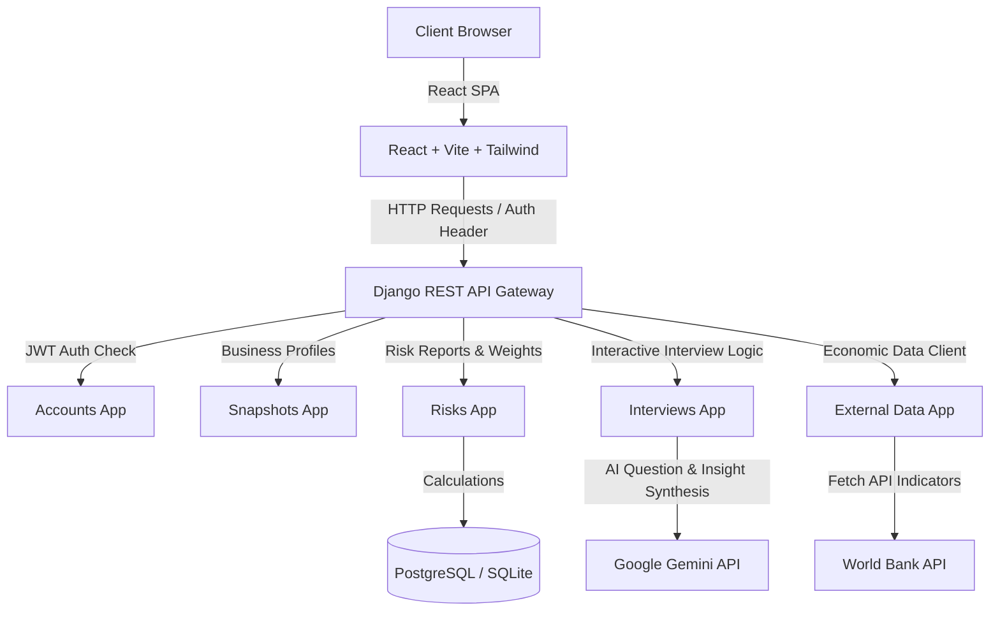

# RisCompass 🧭

RisCompass is a student-built, full-stack risk assessment application designed as a school project to help small business owners, startups, and investors evaluate, understand, and compare geographical and industry-based risks. By marrying macroeconomic indicators (via the World Bank API) with customized local insights collected through interactive AI-assisted interviews (via the Gemini API), RisCompass enables users to build data-informed business snapshot profiles.

---

## 📌 Problem Statement

Entrepreneurs attempting to start or scale businesses in emerging markets, rural regions, or specialized niches often struggle to find clear, actionable, and centralized risk analysis. Existing enterprise solutions are prohibitively expensive, and free regional profiles lack business-specific context. 
* **The Information Gap**: High-level economic indicators are often missing or out of date for remote areas.
* **The Context Gap**: Existing risk databases do not incorporate business-specific variables (budget, target audience, physical vs. digital footprint).

## 💡 Proposed Solution

RisCompass addresses these challenges by offering a personalized, data-driven, and AI-supported risk navigation tool:
1. **Business Snapshots**: Users define localized operational attributes (industry, budget, stage, size, location details).
2. **Hybrid Risk Engine**: For high-data areas (e.g., Berlin), the app automatically pulls macroeconomic indicators (GDP growth, inflation, ease of doing business) from the World Bank API.
3. **AI Interview Remediation**: For low-data areas (e.g., Remote Ethiopia), where macroeconomic APIs fall short, the system triggers an interactive, tailored AI interview session to extract context directly from the user and gauge localized risk levels.
4. **Visual Score breakdowns & Comparison**: Provides radar charts, confidence scores, and a comparison view to evaluate multiple potential business paths side-by-side.

---

## 🛠️ Tech Stack

* **Backend**: Django REST Framework (DRF), PostgreSQL/SQLite, Python
* **Frontend**: React 18, Vite, Tailwind CSS, Recharts
* **External Integrations**: 
  - **World Bank API**: Macroeconomic indicator retrieval
  - **Google Gemini API**: Contextual interview question generation and local insight synthesis
* **Security & Auth**: JSON Web Tokens (JWT) via `django-rest-framework-simplejwt`

---

## ⚙️ System Architecture

RisCompass is structured as a decoupled full-stack application, communication is handled via JSON APIs:



---

## 🗄️ Database Model Summary

RisCompass implements a relational database schema structured across several key Django apps:

### 1. Accounts App (`apps.accounts`)
* **`CustomUser`**: Extended Django abstract user containing `email` (as username), `first_name`, `last_name`, and timestamp fields.

### 2. Regions & Industries (`apps.regions`, `apps.industries`)
* **`Region`**: Represents geographic regions with attributes `country_code` (ISO 3-letter), `region_name`, `city_name`, `region_type` (`urban` or `remote`), and `data_availability_level` (`high`, `medium`, `low`).
* **`Industry`**: Key industry categories (Retail, Tech, Agriculture, Service) and their `default_risk_level`.
* **`IndustryRiskWeight`**: Multipliers mapping weight categories (`financial_weight`, `market_weight`, `legal_weight`, `cultural_weight`, `operational_weight`) summing up to `1.0`.

### 3. Snapshots & Risks (`apps.snapshots`, `apps.risks`)
* **`BusinessSnapshot`**: The core profile detailing `title`, `description`, `business_stage` (Idea, Startup, Existing, Pivot, Expansion), `startup_budget`, `currency`, `target_customer`, `business_size` (Micro, Small, Medium), and `has_physical_location`.
* **`RiskReport`**: Summarized outputs of risk assessments, including category scores (Financial, Market, Legal, Cultural, Operational), `overall_risk_score`, and `confidence_score`.
* **`RiskFactor`**: Atomic risk factors parsed from user inputs, AI answers, or economic indicators.

### 4. Interviews & Comparisons (`apps.interviews`, `apps.comparisons`)
* **`InterviewSession`**: Manages the state (`not_started`, `in_progress`, `completed`, `cancelled`) of low-data region interviews.
* **`InterviewQuestion` & `InterviewAnswer`**: Multi-format questions tailored to industry and answers submitted by the user.
* **`AILocalInsight`**: Synthesis created by the Gemini API summarizing risk signals and warnings.
* **`Comparison`**: Record of side-by-side analysis of two snapshots with custom filter focus.

---

## 🔌 API Endpoints Summary

Base URL: `http://localhost:8000/api/`

| App | Method | Endpoint | Description | Auth Required |
|---|---|---|---|---|
| **Accounts** | `POST` | `/auth/register/` | Register a new user profile | No |
| | `POST` | `/auth/login/` | Obtain JWT Access & Refresh tokens | No |
| | `POST` | `/auth/token/refresh/` | Obtain new access token via refresh token | No |
| | `GET` | `/auth/me/` | Fetch current authenticated user details | Yes (JWT) |
| **Snapshots**| `GET` | `/snapshots/` | List all snapshots belonging to user | Yes (JWT) |
| | `POST` | `/snapshots/` | Create a new business snapshot | Yes (JWT) |
| | `GET` | `/snapshots/<id>/` | View details of a specific snapshot | Yes (JWT) |
| **Risks** | `POST` | `/snapshots/<id>/report/` | Generate or fetch static risk report | Yes (JWT) |
| | `GET` | `/reports/<id>/` | Fetch details of a specific risk report | Yes (JWT) |
| **Interviews**| `POST` | `/interviews/sessions/` | Start or retrieve an interview session | Yes (JWT) |
| | `GET` | `/interviews/sessions/<id>/` | Fetch session details with questions | Yes (JWT) |
| | `POST` | `/interviews/sessions/<id>/answers/` | Submit answers and trigger AI report | Yes (JWT) |
| **Comparisons**| `POST`| `/comparisons/` | Save or request side-by-side comparison | Yes (JWT) |

---

## 🔑 Environment Variables

### Backend (`backend/.env`)
```env
SECRET_KEY=django-insecure-your-development-key
DEBUG=True
ALLOWED_HOSTS=localhost,127.0.0.1
CORS_ALLOWED_ORIGINS=http://localhost:5173

# Database configuration (Defaults to SQLite if omitted)
DB_ENGINE=django.db.backends.sqlite3
DB_NAME=db.sqlite3

# External APIs
GEMINI_API_KEY=your_gemini_api_key_here
WORLD_BANK_API_BASE_URL=https://api.worldbank.org/v2
```

### Frontend (`frontend/.env`)
```env
VITE_API_BASE_URL=http://localhost:8000/api
```

---

## 🚀 Setup & Installation

### Backend Setup
1. **Navigate & Environment Setup**:
   ```bash
   cd backend
   python -m venv venv
   venv\Scripts\activate   # On Windows
   ```
2. **Install Dependencies**:
   ```bash
   pip install -r requirements.txt
   ```
3. **Environment Setup**:
   * Create a `.env` file from `.env.example` (or copy the variables above).
4. **Database Migrations**:
   ```bash
   python manage.py migrate
   ```
5. **Seeding Data**:
   * Seed static regions, industries, and weights:
     ```bash
     python manage.py seed_initial_data
     ```
   * Seed baseline interview questions for AI sessions:
     ```bash
     python manage.py seed_interview_questions
     ```
6. **Start Backend**:
   ```bash
   python manage.py runserver
   ```

### Frontend Setup
1. **Navigate & Install**:
   ```bash
   cd frontend
   npm install
   ```
2. **Environment Setup**:
   * Ensure a `.env` file exists with `VITE_API_BASE_URL=http://localhost:8000/api`.
3. **Start Development Server**:
   ```bash
   npm run dev
   ```
   * The app will open at `http://localhost:5173`.

---

## 🎭 Demo Flow

1. **Sign Up / Log In**: Register a test account.
2. **Create Berlin Tech Cafe Snapshot**: High-data availability test. Set region to `Berlin`, industry to `Tech`. Click "Generate Risk Report" directly. Note the High Confidence score.
3. **Create Remote Ethiopia Agriculture Snapshot**: Low-data availability test. Set region to `Remote Ethiopia Region`, industry to `Agriculture`. Click "Start Interview", answer the interactive questions, and submit.
4. **View AI-Enriched Report**: Observe how Gemini generates local insights and updates confidence levels based on user interview input.
5. **Compare**: Head to `/compare`, choose both snapshots, and view the side-by-side risk score comparison.

---

## ⚠️ Known Limitations
* **World Bank API Latency**: Fetching live data can sometimes lead to slight delays on the first report generation.
* **Offline Fallbacks**: If the Gemini API is unreachable, the system falls back to default risk score calculations without local context.
* **Single Currency Support**: Comparison comparisons are based on risk weights rather than currency conversions.

## 🔮 Future Improvements
* **Automated Data Syncing**: Set up cron jobs to automatically update cached World Bank indicators periodically.
* **Offline Mock LLM Mode**: Implement a local fallback analyzer for when API keys are not supplied.
* **Exporting Options**: Enable users to export generated risk reports to PDF or CSV formats.

---

## 👥 Team Members

This project was built for the Advanced Software Engineering Project course by:
* **Developer 1**: Project Manager & Backend Lead
* **Developer 2**: React Frontend Developer & UX Designer
* **Developer 3**: QA Engineer & Data Analyst
